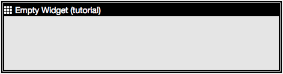
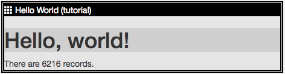
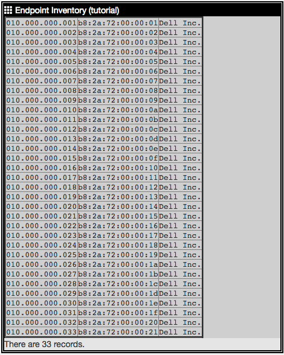
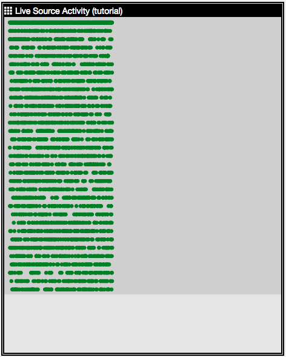

# README
Thomas Phillips <tom@ridgebacknet.com>
:toc:
:toclevels: 2
:!numbered:

This repository contains training materials for creating Ridgeback Hunter dashboard widgets.
The materials are provided for free by Ridgeback Network Defense, Inc.
If you need assistance with the training materials or want help incorporating them into a course of your own, contact us at support@ridgebacknet.com.

## Current Widgets

|===
| *Screenshot* | *Title* | *ID* | *File* | *Description*
|  | Empty Widget | tutorial-empty | tutorial-empty.js | Demonstrates the minimal structure for a widget.
|  | Hello World | tutorial-hello | tutorial-hello.js | Displays "Hello, world!" along with the number of records in the log.
|  | Endpoint Inventory | tutorial-inventory | tutorial-inventory.js | Displays an inventory of IP and MAC addresses.
|  | Live Source Activity | tutorial-sourceActivity | tutorial-sourceActivity.js | Displays a scatter plot of network activity.
|===

## Planned Widgets

See WISHLIST.adoc for a list of widgets under consideration.

## About Ridgeback Hunter

Ridgeback Hunter is an interactive defense platform for network security and network management.
Ridgeback Hunter is extensible with commercial, custom, or open source plugins and widgets.
Let us know if you have requests for new features or extensions.

---

The website for Ridgeback Network Defense is:
http://www.ridgebacknet.com

Support is available at:
support@ridgebacknet.com
